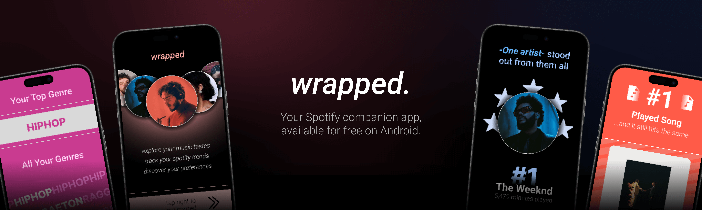

## About

Based on Spotify's annual Spotify Wrapped campaign, Wrapped is an Android app that lets you view your music listening statistics year-round. We use the Spotify Web API to get information about your most-listened tracks and artists, which we then display in colorful and memorable layouts that you can download and share with others. This project was built for Georgia Tech class CS2340.

## Functionality
- Create a Wrapped account and log in from any device
- Connect to Spotify and generate your Wrapped with a variable time span
- See information about your top artists, songs, genres, and music listening personality
- Auto play music from your top albums when the Spotify app is open
- Save your wraps for later viewing, stored in the cloud

## Technologies Used
- Spotify Web API
- Java
- Android Studio
- Firebase
- Figma